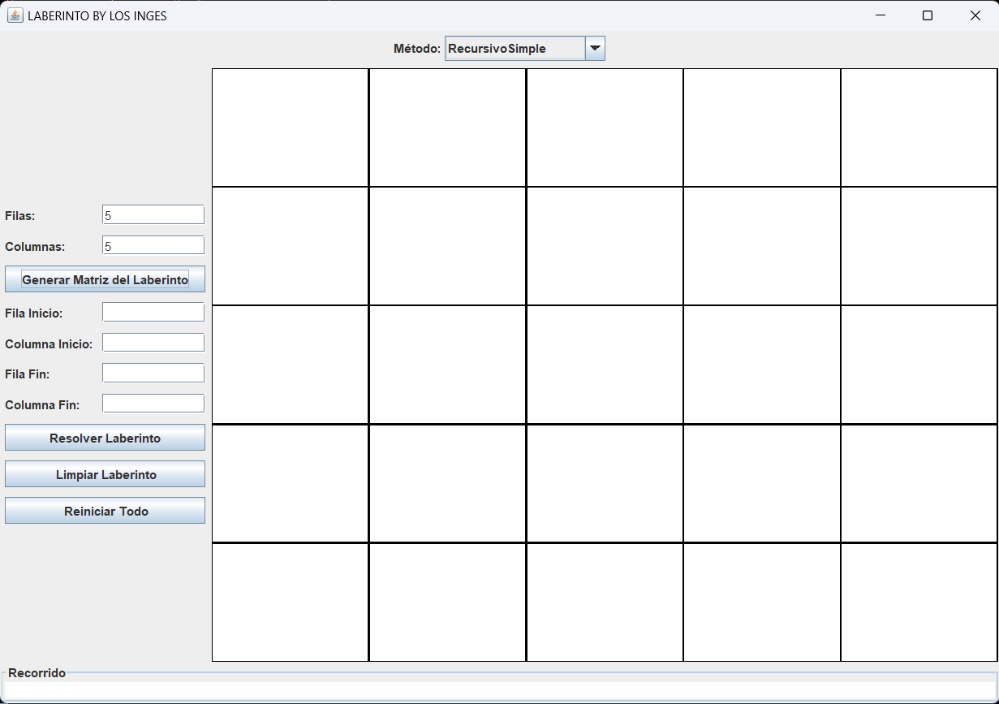

# Informe y Documentación del Proyecto de Laberintos

## Datos Generales

**Universidad:** Universidad Politecnica Salesiana  
**Carrera:** Computación  
**Materia:** Estructura de datos  
**Integrantes:** Daniel Guanga, Alexis Guaman, Luis Coronel

- **Daniel Guanga**  
  - Correo Institucional: [dguangag@est.ups.edu.ec](dguangag@est.ups.edu.ec)
- **Alexis Guaman**
  - Correo Institucional: [aguamanp4@est.ups.edu.ec](aguamanp4@est.ups.edu.ec)
- **Luis Coronel**
  - Correo Institucional: [lcoronelv@est.ups.edu.ec](lcoronelv@est.ups.edu.ec)

## Descripción del Problema

El problema consiste en diseñar e implementar una aplicación que permita resolver laberintos utilizando diferentes algoritmos de búsqueda. La aplicación debe permitir al usuario generar laberintos de diferentes tamaños, marcar celdas como transitables o no transitables, y definir puntos de inicio y fin. Además, debe comparar el desempeño de distintos algoritmos en términos de tiempo de ejecución y eficiencia en encontrar el camino más corto.

## Propuesta de Solución

### Marco Teórico

**Programación Dinámica:**  
La programación dinámica es una técnica de optimización que resuelve problemas almacenando los resultados de subproblemas para evitar cálculos redundantes. Es especialmente útil en problemas de optimización y búsqueda de caminos.

**BFS (Breadth-First Search):**  
El algoritmo de búsqueda en anchura explora todos los nodos de un nivel antes de pasar al siguiente. Es útil para encontrar el camino más corto en grafos no ponderados.

**DFS (Depth-First Search):**  
El algoritmo de búsqueda en profundidad explora lo más lejos posible a lo largo de cada rama antes de retroceder. Es útil para recorrer todos los nodos de un grafo, aunque no garantiza encontrar el camino más corto en todos los casos.

### Descripción de la Propuesta de Solución

Para resolver el problema, se implementó una aplicación en Java utilizando Swing para la interfaz gráfica y algoritmos de búsqueda para resolver el laberinto. Las herramientas y lenguajes utilizados fueron:

- **Lenguaje:** Java
- **Interfaz Gráfica:** Swing
- **Algoritmos:** Recursivo Simple, Programación Dinámica, BFS, DFS

Cada integrante del equipo propuso diferentes criterios y enfoques para la implementación de los algoritmos, los cuales se describen a continuación:

### Criterio por Integrante

- **Daniel Guanga:**
  - Propuso usar el metodo BFS porque este metodo busca por todos los lugares hasta encontrar el final, y esto con la finalidad de que buscara el mejor recorrido o diferentes soluciones de poder llegar al destino, asi si nos pidieran cuantas soluciones puede haber para poder llegar al final, este seria una de las mejores opciones porque estaria recorriendo todos los lugares o secciones para encontrar el destino.
  - Implementó la generación de laberintos y la visualización de la interfaz gráfica.

- **Alexis Guaman:**
  - Sugerió el uso de DFS para explorar completamente el laberinto y comparar su eficiencia con otros métodos. Ya que, el DFS explora tanto como sea posible a lo largo de cada rama antes de retroceder. Porque, es útil para problemas que tienen subestructuras superpuestas y una propiedad conocida como "optimalidad de subestructura" en donde guardara en un cache externo para evitar repetir el mismo lugar recorrido.
  - Implementó la lógica de movimiento del personaje y la animación.

- **Luis Coronel:**
  - Propuso la programación dinámica para optimizar la búsqueda de caminos en laberintos grandes y complejos.
  - Se encargó de la integración de los algoritmos y la medición del tiempo de ejecución.

### Capturas de la Implementación Final de la UI

![Captura 1]

*Aqui podemos ver nuesta interfaz grafica, en la cual podremos crear el laberinto, dar la posición inicial y final de nuestro punto/seccion para empezar, y que metodo a usar para completar nuestro laberinto, y por ultimo dar a los botones para generar la matriz o para empezar a resolverlo o resetear/borrar para empezar de nuevo*

![Captura 2]

*Aqui podremos ver como esta ya generado el laberinto y dando posiciones al punto inicial y final para luego usar algun metodo para resolver nuestro laberinto, por último dando clic a los recuadros podremos colocar los obstaculos en el laberinto para que nuestro punto inicial tenga que buscar otros lados para buscar la seccion final, tambien si no hubiera encontrado solucion te seldra un mensaje "ESTAS ATRAPADO"*

![Captura 3]

*En esta ultima captura vemos como resuelve el laberinto usando el metodo "Recursivo simple" y como nuestro punto inicial era en la poscicion (0,0) pero como vemos en la captura nuestra "img.gif" ya resolvio el laberinto y esta en el punto final que era la posicion (2,2), evitando los obstaculos puestos anteriormente, y tambien vemos como funciona eeste metodo en el cual tomo una solucion pero no es la mas rapida para encontrar el punto final, que solo sigue adelante hasta encontrarse con un obstaculo y cambia su direccion y busca donde hay un lugar libre para seguir y asi econtrar el final*

## Conclusiones

Entre los métodos analizados, el BFS demostró ser la mejor opción para encontrar el camino más corto en laberintos no ponderados. Su capacidad para explorar todos los nodos de un nivel antes de pasar al siguiente garantiza la obtención del camino más corto, aunque puede requerir más memoria que DFS. La programación dinámica también fue eficiente, pero su implementación puede ser más compleja y no siempre necesaria para laberintos pequeños. Ademas, podemos ver que dependiendo del laberinto y donde esten los obstaculos se demoraran más o menos tiempo. Por ultimo, gracias a este trabajo se puede visualizar mejor que metodo puede ser mas eficiente o constante en el tema de resolver y que tenga una complejidad que no se incremente mientras mas grande sea el laberinto y poder entender los codigos y el funcionamiento.

## Consideraciones

### Futuras Mejoras

- **Daniel Guanga:**
  - Propuso implementar algoritmos de búsqueda heurísticos como A* para mejorar la eficiencia en laberintos grandes. Mejorar nuestra interfaz grafica y por ultimo que nuestro laberinto se pueda seleccionar que punto inicial y final por medio del raton y no usando campos de texto.

- **Alexis Guaman:**
  - Propuso añadir la capacidad de guardar y cargar laberintos desde archivos.

- **Luis Coronel:**
  - Propuso agregar una funcionalidad de generación de laberintos aleatorios más compleja, incluyendo laberintos ponderados.

### Aplicaciones

- **Daniel Guanga:**
  - Puede ser aplicaca en la robótica para la navegación autónoma de robots en entornos complejos.

- **Alexis Guaman:**
  - En el uso en videojuegos para generar niveles de manera procedimental y mejorar la jugabilidad.

- **Luis Coronel:**
  - Puede ser aplicaca en la optimización de rutas de entrega en logística, minimizando tiempos de desplazamiento y costos.
